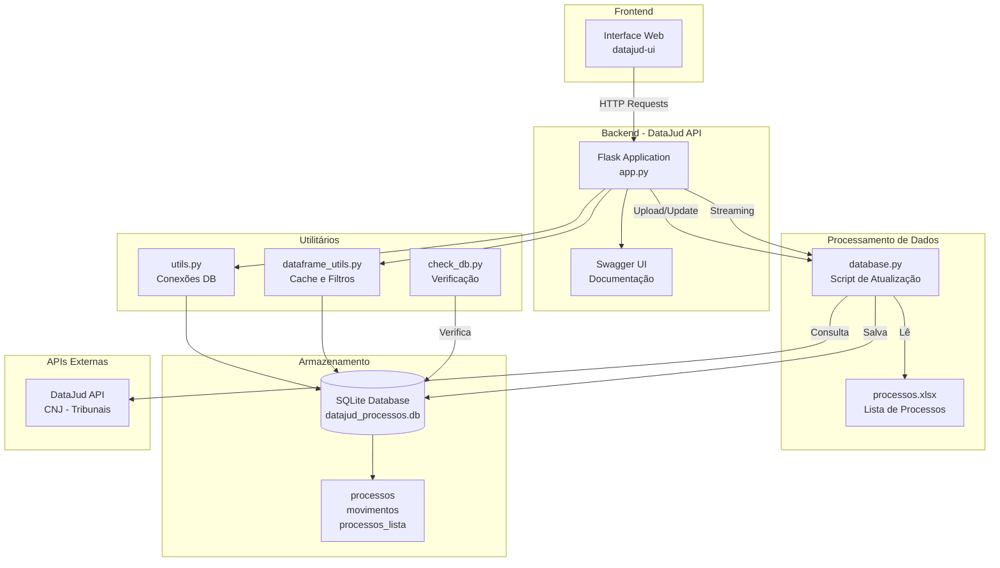

# DataJud API

## 📋 Descrição do Projeto

A **DataJud API** é uma aplicação Flask que fornece uma interface REST para consulta e gerenciamento de dados de processos judiciais obtidos através da API pública do DataJud (Conselho Nacional de Justiça). A aplicação permite:

- Consulta de processos judiciais por número
- Visualização de movimentações processuais
- Filtros por tribunal e categoria
- Upload e gerenciamento de listas de processos via Excel
- Atualização automática do banco de dados
- Interface web para visualização dos dados

## 🏗️ Arquitetura da Aplicação



## 🚀 Instalação e Configuração

### Pré-requisitos

- Python 3.8 ou superior
- pip (gerenciador de pacotes Python)
- Git (para clonar o repositório)

### 1. Clone o Repositório

```bash
git clone <url-do-repositorio>
cd datajud-api
```

### 2. Criação do Ambiente Virtual

```bash
# Criar ambiente virtual
python -m venv venv

# Ativar ambiente virtual
# No Windows:
venv\Scripts\activate
# No Linux/Mac:
source venv/bin/activate
```

### 3. Instalação das Dependências

```bash
pip install -r requirements.txt
```

### 4. Configuração do Ambiente

Crie um arquivo `.env` na raiz do projeto (opcional):

```env
# Configurações do banco de dados
DATAJUD_DB_PATH=datajud_processos.db

# Configurações do Flask
FLASK_ENV=development
FLASK_RUN_HOST=0.0.0.0
FLASK_RUN_PORT=5000

# API Key do DataJud (opcional - há uma chave padrão no código)
DATAJUD_APIKEY=sua_chave_aqui
```

### 5. Inicialização do Banco de Dados

O projeto já inclui um arquivo `processos.xlsx` de exemplo. Para inicializar o banco de dados:

```bash
# Executar script de atualização do banco
python database.py
```

Este comando irá:
- Criar o banco SQLite se não existir
- Consultar a API do DataJud para cada processo do arquivo Excel
- Salvar os dados no banco local

## 🏃‍♂️ Executando a Aplicação

```bash
# Executar a aplicação
python app.py
```

A aplicação estará disponível em:
- **API**: http://localhost:5000
- **Documentação Swagger**: http://localhost:5000/apidocs

## 📚 Endpoints da API

### Processos

| Método | Endpoint | Descrição |
|--------|----------|-----------|
| GET | `/processos` | Lista processos com filtros |
| GET | `/processos-lista` | Lista mestra de processos |
| GET | `/processo/<numero>` | Dados completos de um processo |

### Movimentações

| Método | Endpoint | Descrição |
|--------|----------|-----------|
| GET | `/movimentos/<numero>` | Movimentações de um processo |

### Filtros e Categorias

| Método | Endpoint | Descrição |
|--------|----------|-----------|
| GET | `/tribunais` | Lista de tribunais disponíveis |
| GET | `/categorias` | Lista de categorias disponíveis |

### Atualizações

| Método | Endpoint | Descrição |
|--------|----------|-----------|
| GET | `/atualizacoes` | Processos agrupados por período |
| GET | `/atualizacoes-dataframe` | Atualizações com dados do Excel |

### Upload e Gerenciamento

| Método | Endpoint | Descrição |
|--------|----------|-----------|
| POST | `/upload-processos` | Upload de arquivo Excel |
| GET | `/template-excel` | Download do template Excel |
| POST | `/confirm-replace` | Confirma substituição do Excel |
| POST | `/update-database` | Atualiza banco de dados |
| POST | `/update-database-stream` | Atualização com streaming |

### Utilitários

| Método | Endpoint | Descrição |
|--------|----------|-----------|
| GET | `/health` | Verificação de saúde |
| POST | `/clear-database` | Limpa banco de dados |
| POST | `/update-filter-lists` | Atualiza listas de filtros |

## 🔧 Comandos Úteis

### Verificação do Banco

```bash
# Verificar conteúdo do banco
python check_db.py
```

### Teste das Funções

```bash
# Testar funções de dataframe
python dataframe_utils.py
```

## 📁 Estrutura do Projeto

```
datajud-api/
├── app.py                 # Aplicação Flask principal
├── database.py            # Script de atualização do banco
├── utils.py               # Utilitários de conexão
├── dataframe_utils.py     # Utilitários de dataframe e cache
├── check_db.py            # Script de verificação do banco
├── requirements.txt       # Dependências Python
├── processos.xlsx         # Lista de processos (exemplo)
├── datajud_processos.db   # Banco SQLite (gerado)
└── README.md              # Este arquivo
```

## 🗄️ Estrutura do Banco de Dados

### Tabela `processos`
Armazena informações principais dos processos:
- `numeroProcesso`: Número único do processo
- `tribunal`: Código do tribunal
- `classe_nome`: Nome da classe processual
- `sistema_nome`: Nome do sistema
- `dataHoraUltimaAtualizacao`: Data da última atualização

### Tabela `movimentos`
Armazena movimentações processuais:
- `numeroProcesso`: Referência ao processo
- `mov_nome`: Nome do movimento
- `mov_dataHora`: Data e hora do movimento
- `mov_orgao_nome`: Órgão responsável

### Tabela `processos_lista`
Índice mestre de processos:
- `numeroProcesso`: Chave primária
- `tribunal_inicial`: Tribunal onde foi encontrado
- `primeiraInclusao`: Data da primeira inclusão
- `ultimoUpdate`: Data da última atualização

## ⚙️ Configurações Avançadas

### Variáveis de Ambiente

| Variável | Descrição | Padrão |
|----------|-----------|---------|
| `DATAJUD_DB_PATH` | Caminho do banco SQLite | `datajud_processos.db` |
| `FLASK_ENV` | Ambiente Flask | `production` |
| `FLASK_RUN_HOST` | Host de execução | `0.0.0.0` |
| `FLASK_RUN_PORT` | Porta de execução | `5000` |
| `DATAJUD_APIKEY` | Chave da API DataJud | Chave padrão incluída |

### Otimizações

1. **Cache de DataFrames**: Sistema de cache automático para melhorar performance
2. **Busca Otimizada**: Se o Excel contém coluna `tribunal`, busca apenas no tribunal específico
3. **Paginação**: Endpoints suportam paginação com `limit` e `offset`
4. **Streaming**: Atualização do banco com feedback em tempo real

## 🐛 Solução de Problemas

### Problemas Comuns

1. **Banco não encontrado**
   ```bash
   # Verificar se o arquivo existe
   ls -la datajud_processos.db
   
   # Executar database.py para criar
   python database.py
   ```

2. **Erro de conexão com DataJud**
   - Verificar conexão com internet
   - Verificar se a API está disponível
   - Verificar chave de API

3. **Arquivo Excel não encontrado**
   - O arquivo `processos.xlsx` já está incluído no repositório
   - Verificar se o arquivo está na raiz do projeto

4. **Erro de dependências**
   ```bash
   # Reinstalar dependências
   pip install -r requirements.txt --force-reinstall
   ```

### Logs e Debug

```bash
# Executar com logs detalhados
FLASK_ENV=development python app.py

# Verificar logs do banco
python check_db.py
```

## 📝 Exemplos de Uso

### Consultar Processos

```bash
# Listar todos os processos
curl "http://localhost:5000/processos"

# Filtrar por tribunal
curl "http://localhost:5000/processos?tribunal=TJSP"

# Filtrar por categoria
curl "http://localhost:5000/processos?categoria=Cível"

# Com paginação
curl "http://localhost:5000/processos?limit=10&offset=0"
```

### Upload de Arquivo

```bash
# Upload de arquivo Excel
curl -X POST -F "file=@processos.xlsx" http://localhost:5000/upload-processos

# Atualizar banco
curl -X POST http://localhost:5000/update-database
```

### Consultar Movimentações

```bash
# Movimentações de um processo
curl "http://localhost:5000/movimentos/1234567-89.2023.1.01.0001"
```

## 📞 Suporte

Para suporte e dúvidas:
- Consulte a documentação Swagger em `/apidocs`
- Verifique os logs da aplicação

---

**DataJud API** - Interface REST para consulta de processos judiciais via API do CNJ